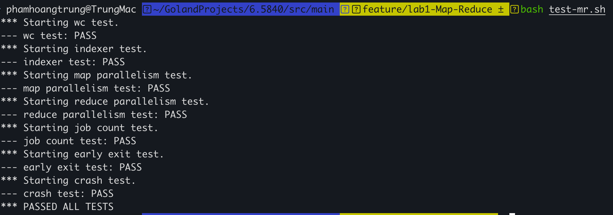

# Lab01: Distributed MapReduce in Go

## Overview

This project implements a fault-tolerant, distributed MapReduce system in Go, inspired by the original MapReduce paper. It was developed as part of MIT 6.5840 coursework.

The system supports:

- Dynamic task assignment over RPC
- Crash fault tolerance (workers may fail and tasks will be reassigned)
- Parallel execution of map and reduce tasks
- Correct merging of output to match sequential reference

The implementation consists of a **Coordinator** (master) process and multiple **Worker** processes communicating over Go RPC on a shared filesystem.

---

## Fault Tolerance

- Coordinator reassigns tasks that timeout
- Workers handle RPC errors gracefully
- Coordinator and workers terminate cleanly when the job completes
- Uses atomic writes (via temporary files and renaming) to prevent partial file writes on crash

---

## File Layout
- `src/`
    - `main/`
        - `mrcoordinator.go` – Entry point for Coordinator
        - `mrworker.go` – Entry point for Worker
        - `mrsequential.go` – Reference sequential implementation
        - `test-mr.sh` – Automated test suite
    - `mr/`
        - `coordinator.go` – Your Coordinator implementation
        - `worker.go` – Your Worker implementation
        - `rpc.go` – Shared RPC types
    - `mrapps/`
        - `wc.go` – Word count application plugin
        - `indexer.go` – Text indexing plugin

---

## Testing
