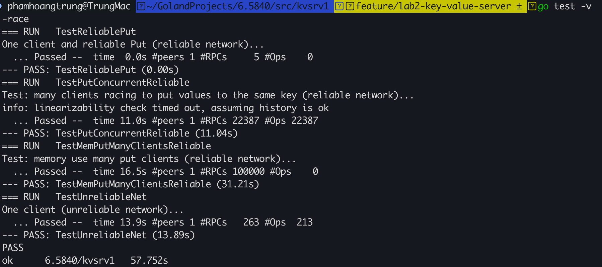

# Lab01: Distributed MapReduce in Go

## Overview

This project implements a fault-tolerant, distributed MapReduce system in Go, inspired by the original MapReduce paper. It was developed as part of MIT 6.5840 coursework.

The system supports:

- Dynamic task assignment over RPC
- Crash fault tolerance (workers may fail and tasks will be reassigned)
- Parallel execution of map and reduce tasks
- Correct merging of output to match sequential reference

The implementation consists of a **Coordinator** (master) process and multiple **Worker** processes communicating over Go RPC on a shared filesystem.

---

## Fault Tolerance

- Coordinator reassigns tasks that timeout
- Workers handle RPC errors gracefully
- Coordinator and workers terminate cleanly when the job completes
- Uses atomic writes (via temporary files and renaming) to prevent partial file writes on crash

---

## File Layout

- [`src/`](src/)
    - [`main/`](src/main/)
        - [`mrcoordinator.go`](src/main/mrcoordinator.go) – Entry point for Coordinator
        - [`mrworker.go`](src/main/mrworker.go) – Entry point for Worker
        - [`mrsequential.go`](src/main/mrsequential.go) – Reference sequential implementation
        - [`test-mr.sh`](src/main/test-mr.sh) – Automated test suite
    - [`mr/`](src/mr/)
        - [`coordinator.go`](src/mr/coordinator.go) – Your Coordinator implementation
        - [`worker.go`](src/mr/worker.go) – Your Worker implementation
        - [`rpc.go`](src/mr/rpc.go) – Shared RPC types
    - [`mrapps/`](src/mrapps/)
        - [`wc.go`](src/mrapps/wc.go) – Word count application plugin
        - [`indexer.go`](src/mrapps/indexer.go) – Text indexing plugin

## Testing

---

# Lab02: Key/Value Server and Distributed Lock

## Overview

This project implements a **key/value server** for a single machine that:

- Ensures **at-most-once** execution for Put operations despite network failures.
- Guarantees **linearizability** of operations.
- Supports building a distributed **lock service** on top of it.

The final server is robust to dropped, delayed, or re-ordered network messages, while offering a simple, predictable interface to clients.

---

## Features Implemented

### ✅ Reliable KV Server
- Handles `Put` and `Get` RPCs from clients.
- Maintains an in-memory map: `map[key] = (value, version)`.
- Enforces conditional updates with version numbers to prevent lost updates.
- Supports concurrent client operations with **linearizability guarantees**.

### ✅ Client Retry Logic
- Clients automatically retry RPCs on timeout or dropped responses.
- Correctly distinguishes between:
    - `ErrVersion` (definite conflict)
    - `ErrMaybe` (possible previous success but reply lost)
- Ensures at-most-once semantics for Put under unreliable networks.

### ✅ Distributed Lock Built on KV Clerk
- Implements `Acquire` and `Release` methods.
- Multiple clients coordinate using the KV server to achieve mutual exclusion.
- Correctly handles `ErrMaybe` by retrying or detecting lock conflicts.

## File Layout

- [`src/`](src/)
    - [`kvsrv1/`](src/kvsrv1/)
        - [`client.go`](src/kvsrv1/client.go) – Clerk logic: Put/Get RPCs with retries, ErrMaybe handling
        - [`server.go`](src/kvsrv1/server.go) – Server logic: conditional Put/Get handlers
        - [`rpc/`](src/kvsrv1/rpc/)
            - [`rpc.go`](src/kvsrv1/rpc/rpc.go) – RPC types, error definitions
        - [`lock/`](src/kvsrv1/lock/)
            - [`lock.go`](src/kvsrv1/lock/lock.go) – Distributed lock built on Clerk.Put/Get
        - [`kvsrv_test.go`](src/kvsrv1/kvsrv_test.go) – Test suite

## Testing
