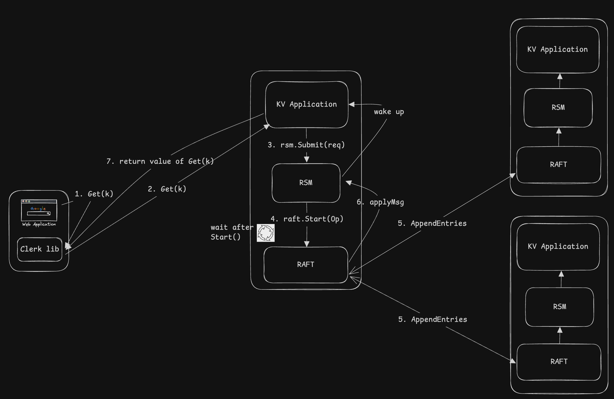
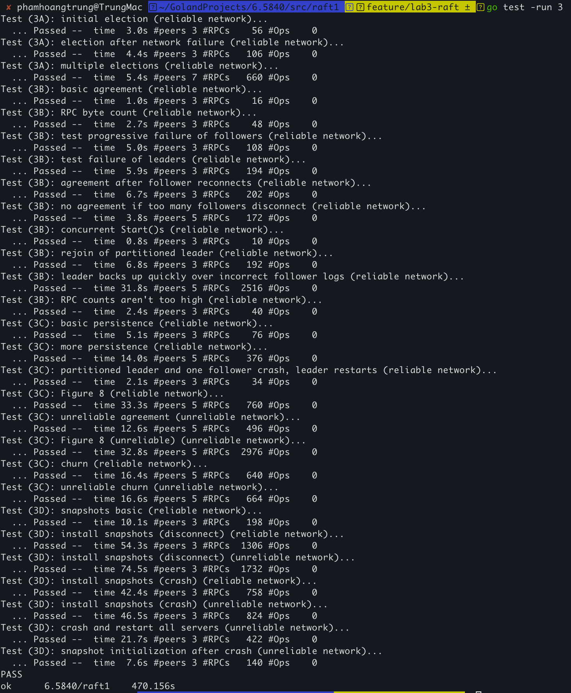
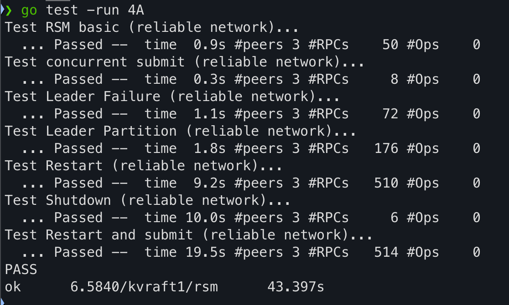
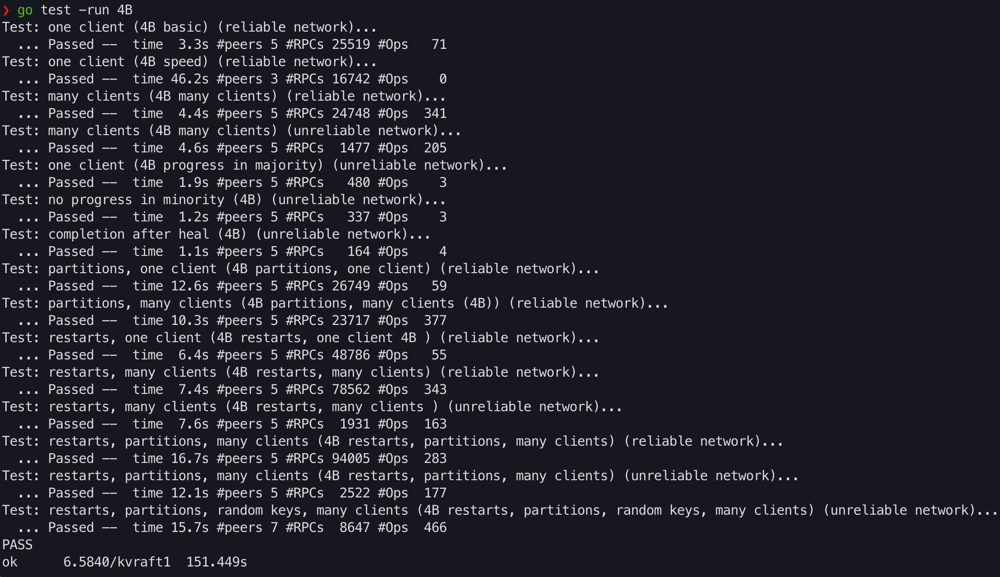
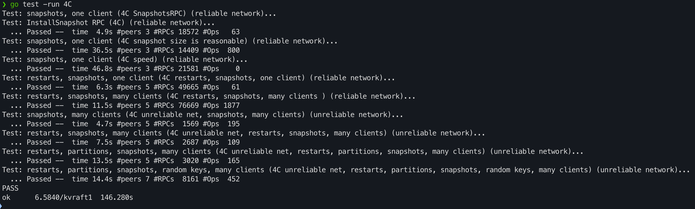

# Table of Contents

- [Lab01: Distributed MapReduce in Go](#lab01-distributed-mapreduce-in-go)
- [Lab02: Key/Value Server and Distributed Lock](#lab02-keyvalue-server-and-distributed-lock)
- [Lab03: Replicated State Machine with Raft](#lab03-replicated-state-machine-with-raft)
- [Lab04: Fault-Tolerant Key/Value Storage with Raft](#lab04-fault-tolerant-keyvalue-storage-with-raft)

---
# Summary of Labs
As part of MIT 6.5840, I built a fault-tolerant, strongly consistent distributed key/value store in Go, structured into four key components:

- **Clerk** – The client-side component that handles retries and transparently routes requests to the current Raft leader. It ensures user operations (e.g., Get/Put) are eventually delivered and processed even under failures or leadership changes.

- **Application Layer (KV Server)** – This is the main entry point to the system, it exposes a key/value API to clients. It handles deduplication of client requests and manages state updates. This layer is agnostic of Raft and relies on the RSM to apply operations.

- **Replicated State Machine (RSM)** – Acts as a middleware between the application and Raft. It forwards committed log entries to the application, manages snapshot creation when Raft log grows too large, and restores application state on restart or recovery.

- **Raft Consensus Module** – Ensures fault-tolerant replication and ordering of client commands. It handles leader election, log replication, crash recovery, and snapshot installation, guaranteeing that a majority of servers agree on a consistent sequence of operations.

Together, these components create a robust system that remains available and correct despite crashes, partitions, and unreliable networks. Every layer was tested under adversarial conditions to ensure correctness, recoverability, and linearizability.
# System Architecture Overview

# Lab01: Distributed MapReduce in Go

## Overview

This project implements a fault-tolerant, distributed MapReduce system in Go, inspired by the original MapReduce paper. It was developed as part of MIT 6.5840 coursework.

The system supports:

- Dynamic task assignment over RPC
- Crash fault tolerance (workers may fail and tasks will be reassigned)
- Parallel execution of map and reduce tasks
- Correct merging of output to match sequential reference

The implementation consists of a **Coordinator** (master) process and multiple **Worker** processes communicating over Go RPC on a shared filesystem.

## Fault Tolerance

- Coordinator reassigns tasks that timeout
- Workers handle RPC errors gracefully
- Coordinator and workers terminate cleanly when the job completes
- Uses atomic writes (via temporary files and renaming) to prevent partial file writes on crash

## File Layout

- [`src/`](src/)
    - [`mr/`](src/mr/)
        - [`coordinator.go`](src/mr/coordinator.go) – Coordinator implementation
        - [`worker.go`](src/mr/worker.go) – Worker implementation
        - [`rpc.go`](src/mr/rpc.go) – Shared RPC types

## Testing

---
# Lab02: Key/Value Server and Distributed Lock

## Overview

This project implements a **key/value server** for a single machine that:

- Ensures **at-most-once** execution for Put operations despite network failures.
- Guarantees **linearizability** of operations.
- Supports building a distributed **lock service** on top of it.

The final server is robust to dropped, delayed, or re-ordered network messages, while offering a simple, predictable interface to clients.

## Features Implemented
### ✅ Reliable KV Server
- Handles `Put` and `Get` RPCs from clients.
- Maintains an in-memory map: `map[key] = (value, version)`.
- Enforces conditional updates with version numbers to prevent lost updates.
- Supports concurrent client operations with **linearizability guarantees**.

### ✅ Client Retry Logic
- Clients automatically retry RPCs on timeout or dropped responses.
- Correctly distinguishes between:
    - `ErrVersion` (definite conflict)
    - `ErrMaybe` (possible previous success but reply lost)
- Ensures at-most-once semantics for Put under unreliable networks.

### ✅ Distributed Lock Built on KV Clerk
- Implements `Acquire` and `Release` methods.
- Multiple clients coordinate using the KV server to achieve mutual exclusion.
- Correctly handles `ErrMaybe` by retrying or detecting lock conflicts.

## File Layout

- [`src/`](src/)
    - [`kvsrv1/`](src/kvsrv1/)
        - [`client.go`](src/kvsrv1/client.go) – Clerk logic: Put/Get RPCs with retries, ErrMaybe handling
        - [`server.go`](src/kvsrv1/server.go) – Server logic: conditional Put/Get handlers
        - [`rpc/`](src/kvsrv1/rpc/)
            - [`rpc.go`](src/kvsrv1/rpc/rpc.go) – RPC types, error definitions
        - [`lock/`](src/kvsrv1/lock/)
            - [`lock.go`](src/kvsrv1/lock/lock.go) – Distributed lock built on Clerk.Put/Get
        - [`kvsrv_test.go`](src/kvsrv1/kvsrv_test.go) – Test suite

## Testing

---
# Lab03: Replicated State Machine with Raft

## Overview

This project implements Raft, a fault-tolerant replicated state machine protocol, in Go.

Raft ensures consistency across multiple servers by replicating a log of client commands. Even in the presence of crashes or network partitions, a majority of servers can continue making progress and maintain a coherent service state.

## Features Implemented

- Leader election with randomized timeouts
- Log replication and consistency
- Crash recovery via persistent state
- Log compaction through snapshotting
- Correct operation despite network partitions and reordering

This implementation closely follows the *extended Raft paper*, with particular attention to Figure 2, and serves as a solid foundation for building higher-level distributed services.

## File Layout

- [`src/`](src/)
    - [`raft1/`](src/raft1/)
        - [`raft.go`](src/raft1/raft.go) – Raft implementation
        - [`persister.go`](src/raft1/persister.go) – Persistent state abstraction

## Development Notes

This lab was completed in four parts, each adding essential features:

### Part 3A: Leader Election
- Randomized timeouts to trigger elections
- RequestVote RPCs
- AppendEntries RPCs as heartbeats
- Ensures a single leader exists and recovers leadership after failures

### Part 3B: Log Replication
- Client commands added to the replicated log
- AppendEntries RPCs carry new log entries
- Correct handling of log consistency and conflicts
- Commit index tracking and ApplyMsg delivery

### Part 3C: Persistence
- Persistent storage of Raft state (term, vote, log)
- Crash/restart recovery via serialization with labgob
- Integration with Persister abstraction

### Part 3D: Log Compaction (Snapshotting)
- Service-layer snapshot support via `Snapshot()`
- Log truncation before snapshot index
- InstallSnapshot RPC to synchronize lagging peers
- Persistent storage of both Raft state and snapshot data

## Testing

---
# Lab04: Fault-Tolerant Key/Value Storage with Raft

## Overview

This project implements a fault-tolerant, distributed key/value store in Go using the Raft consensus protocol. 
It builds upon the Raft library developed in Lab 3 and the client/server interface from Lab 2. The system ensures strong consistency and availability under network partitions and node failures, maintaining a linearizable history of operations.

The system supports:

* Replicated key/value storage with strong consistency
* Transparent leader election and failure handling via Raft
* Snapshotting to avoid unbounded Raft log growth
* Transparent request retry and redirection in the presence of leader changes
* Seamless recovery from crashes using persisted Raft state and service snapshots

## Fault Tolerance

* Client operations are retried until they reach the current Raft leader
* Operations are committed via consensus before applying to the state machine
* The system tolerates network partitions and server crashes as long as a majority of servers remain connected
* Snapshots are taken when the Raft state exceeds a threshold, ensuring fast recovery
* Servers restore their key/value state and Raft metadata from persistent storage

## Development Notes
Be prepared to fix bugs and handle edge cases, as with the complexity of the current layer will expose more issues than previous labs. \
It costed me 2-3 days to get the code for the previous Raft Lab working reliably, with many iterations of debugging and testing.

### Part A: Replicated State Machine (RSM)
* Implemented the `rsm.Submit()` method that wraps operations, assigns unique IDs, and waits for Raft to commit them.
* A background goroutine reads from `applyCh` and dispatches committed operations to the application-defined `StateMachine.DoOp()`.
* Passed all 4A tests reliably:

### Part B: Key/Value Service without Snapshots

* Built a `kvserver` layer using the `rsm` abstraction to apply `Get` and `Put` operations.
* Implemented a Clerk with retry and leader tracking logic to improve performance and fault tolerance.
* Ensured all operations, including reads, are committed via Raft for consistency.
* Avoided duplicate client requests by tracking client request IDs.
* Successfully passed all 4B tests including network partitions, client restarts, and concurrent workloads:

### Part C: Snapshot Integration

* Integrated snapshot creation into `rsm` based on `maxraftstate`.
* Snapshots include both Raft and key/value state, allowing fast recovery after crashes.
* `kvserver` implements `Snapshot()` and `Restore()` for state serialization and recovery.
* Passed snapshot tests including reboot scenarios:

## File Layout
* [`src/`](src/)
    * [`kvraft1/`](src/kvraft1/)
        * [`rsm/rsm.go`](src/kvraft1/rsm/rsm.go) – Replicated state machine using Raft
        * [`server.go`](src/kvraft1/server.go) – Key/value server logic
        * [`client.go`](src/kvraft1/client.go) – Clerk implementation for clients
        * [`kvtest.go`](src/kvraft1/kvtest.go) – Test harness and test cases

